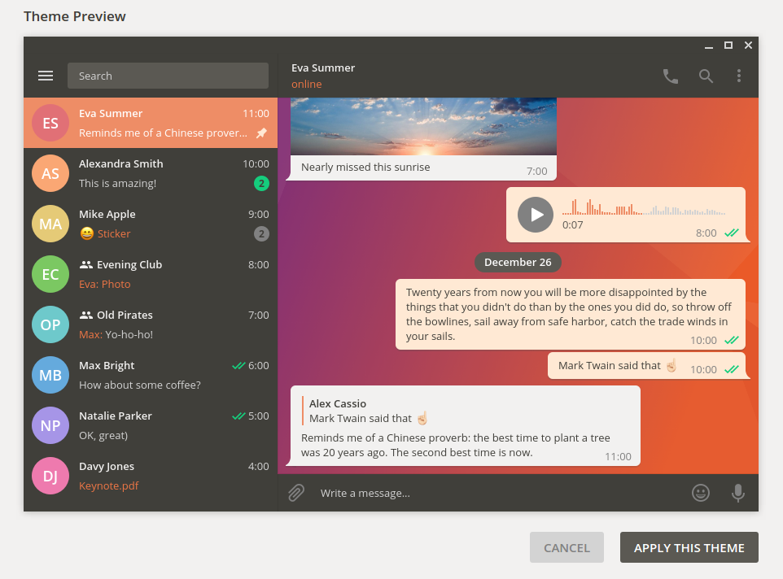

# Ubuntu Dark Theme for Telegram Desktop
#### Version 2.00
A telegram desktop theme in stylish ubuntu design pattern. It fits perfectly into your Ambiance theming!

### Install
1. Clone the git repisitory github.com/michaelkisiel/ubuntu-dark-telegram-theme or download the file [UbuntuDark2-00.tdesktop-theme](https://github.com/michaelkisiel/ubuntu-dark-telegram-theme/blob/master/UbuntuDark2-00.tdesktop-theme)
2. Paste the file into any chat of your telegram desktop client
3. You will be asked to apply the theme showing you a preview before

But here's also an official Telegram Support guide on how to edit and install Telegram Desktop themes: http://telegra.ph/Create-Telegram-Theme-01-12.

### Contact
Just send me [@droopymccool](https://t.me/droopymccool) a message in telegram. :wink:
Join [@UbuntuThemesChannel](https://t.me/UbuntuThemesChannel) for instant news and notifications about changes in the theme.

### Screenshots

